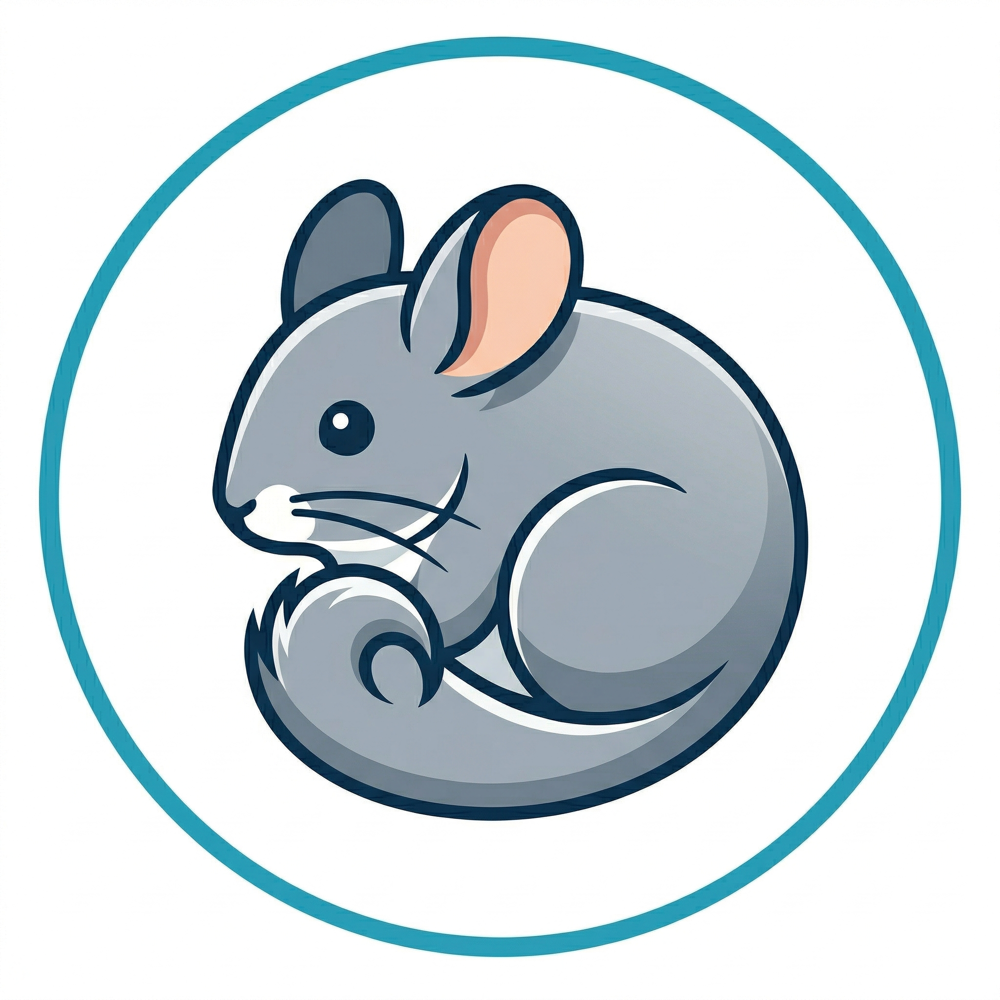

<p align="center">
  
</p>

<h1 align="center">clinic-classifier</h1>

<p align="center">
  <em>Semantic assistant that maps free‑text clinical diagnoses to <strong>ICD‑10‑ES (CIE‑10‑ES)</strong> codes.</em>
</p>

<p align="center">
  <a href="https://github.com/Aitorsiius/clinic-classifier/actions/workflows/sonarcloud.yml"></a>
  <a href="https://sonarcloud.io/summary/new_code?id=Aitorsiius_clinic-classifier"></a>
  <a href="https://sonarcloud.io/summary/new_code?id=Aitorsiius_clinic-classifier"></a>
</p>

<p align="center">
  <a href="https://sonarcloud.io/summary/new_code?id=Aitorsiius_clinic-classifier"></a>
  <a href="https://sonarcloud.io/summary/new_code?id=Aitorsiius_clinic-classifier"></a>
  <a href="https://sonarcloud.io/summary/new_code?id=Aitorsiius_clinic-classifier"></a>
  <a href="https://sonarcloud.io/summary/new_code?id=Aitorsiius_clinic-classifier"></a>
  <a href="https://sonarcloud.io/summary/new_code?id=Aitorsiius_clinic-classifier"></a>
  <a href="https://sonarcloud.io/summary/new_code?id=Aitorsiius_clinic-classifier"></a>
  <a href="https://sonarcloud.io/summary/new_code?id=Aitorsiius_clinic-classifier"></a>
</p>

<p align="center">
  
  
  
  
</p>

---

## What is it?

**clinic-classifier** bridges the gap between how clinicians *write* (free text, abbreviations,
colloquial wording) and how a medical catalogue is *indexed* (technical, hierarchical titles).
You type a diagnosis in natural language and the tool returns the most likely **ICD‑10‑ES**
codes, ranked by relevance.

Instead of relying on a single model, it runs a **multi‑stage semantic pipeline**:

1. **AI query enrichment** *(optional)* — an LLM interprets the text and rewrites it into the
   canonical diagnosis term, without inventing data the user didn't provide.
2. **Bi‑encoder retrieval** — embeddings fetch the closest candidate codes from a vector database.
3. **Cross‑encoder re‑ranking** — a re‑ranker reorders candidates, with extra tie‑breaking by
   clinical axes (laterality, anatomical site, complications…).

## What is it for?

- **Assisted coding** — suggest ICD‑10‑ES codes for a clinical description in seconds.
- **Batch auditing** — upload a CSV of diagnoses with their assigned codes and check, at scale,
  whether the coding looks correct.
- **Coding quality feedback** — the assistant points out which clinical details are missing
  (laterality, episode of care, severity…) that would narrow the result to a single code.

## Features

- 🔎 Natural‑language → ICD‑10‑ES classification with a retrieval + re‑ranking pipeline.
- 🧠 Optional LLM enrichment phase to close the colloquial ↔ technical gap.
- 📄 CSV batch audit mode with live progress and real elapsed‑time tracking.
- 🔐 JWT authentication, per‑user history and logging.
- 🧩 Microservice architecture orchestrated with Docker Compose.

## Architecture

The system is a set of containerized microservices on a private Docker network. Only the
reverse proxy is reachable from outside (ports **80 / 443 / 3000**); every other service talks
internally over the bridge network.

| Service | Role |
|---|---|
| `app` | React + Vite web frontend |
| `api-gateway` | Single entry point / request routing |
| `backend` | Classification pipeline (retrieval + re‑ranking over a vector DB) |
| `embeddings` | Bi‑encoder embeddings (`multilingual-e5-base`) |
| `reranker` | Cross‑encoder re‑ranker (`ms-marco-MiniLM`) |
| `llm-query-processor` | LLM query enrichment (Vertex AI / Gemini) |
| `audit-service` | CSV batch auditing |
| `auth-service` | JWT authentication |
| `history-service` | Per‑user search/audit history |
| `log-service` | Centralized logging |
| `caddy` | Reverse proxy + TLS (the only externally exposed component) |

## Tech stack

- **Backend:** Python 3.11, FastAPI, Qdrant (vector DB), MongoDB Atlas
- **ML:** Hugging Face Text Embeddings Inference (bi‑encoder + cross‑encoder), Vertex AI (Gemini)
- **Frontend:** React, Vite, TypeScript, Tailwind CSS
- **Infra:** Docker Compose, Caddy
- **Quality:** pytest + coverage, SonarCloud (CI on every push / PR to `main`)

## Quick start

> Requires Docker and Docker Compose.

```bash
# 1. Configure environment variables (JWT secret, MongoDB connection, Vertex AI, etc.)
cp .env.example .env   # then edit .env

# 2. Build and start the whole stack
docker compose up -d --build
```

Once healthy, open the web app at **https://localhost**.

## Testing

Each microservice has its own test suite. The helper script runs them all and produces one
coverage report per service (consumed by SonarCloud):

```bash
./run-tests.sh
```
